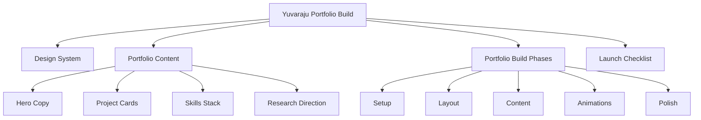

# Portfolio Workspace Plan

## Overview

<aside>
🚀

This plan turns your resume and the [Landonorris.com](http://Landonorris.com)-inspired direction into a Notion portfolio-building workspace — not just a static checklist. The goal is to organize your **AI/ML + Space-AI researcher identity**, projects, design system, build phases, content, and launch tasks in one place.

</aside>

The portfolio concept will adapt the premium racing-site feel into your personal brand: **AI / space research / engineering**, with a dark editorial layout, one neon accent, bold motion, and clear proof of work. Instead of copying Lando Norris directly, the structure will translate the same patterns — sticky header, full-bleed hero, marquee, scroll reveals, project cards, and a dramatic footer — into a portfolio that feels original and relevant to your resume.

I’ll use your existing workspace foundation by organizing the work around connected Notion sections: a main portfolio hub page, a project/content database, a build phases board, a design system reference, and a launch checklist. This gives you a place to plan the site before building it in Webflow, Framer, or Next.js.

## Your Preferences

- **Portfolio identity:** AI/ML Engineer, CSE–AI undergrad, aspiring ISRO / Space-AI researcher
- **Inspiration:** [Landonorris.com](http://Landonorris.com)-style premium motion site
- **Visual direction:** dark near-black/olive palette, one neon lime accent, off-white typography
- **Tech stack options:** Webflow/Framer for no-code, or Next.js/React for coded build
- **Motion direction:** GSAP + ScrollTrigger, Lenis smooth scroll, marquee, cursor-following signature, scroll reveals
- **Content source:** resume details, projects, skills, certifications, languages, interests
- **Workspace output:** a Notion planning system for the portfolio, with build phases and reusable content structure

## Implementation Plan

### Step 1: Create portfolio hub

Create a main page named **Yuvaraju Portfolio Build** as the command center for the whole project.

Include sections for:

- **Vision** — a short positioning statement for your portfolio
- **Site sections** — hero, about, projects, skills, research direction, certifications, contact
- **Quick links** — GitHub, LinkedIn, LeetCode, resume email/contact
- **Build progress** — linked view of the build phases board
- **Design system** — linked reference section

<aside>
🧭

The hub should make the portfolio feel like a real product build, not just a resume rewrite.

</aside>

### Step 2: Define site architecture

Map the portfolio into clear web sections inspired by [Landonorris.com](http://Landonorris.com), but customized for your AI/space-AI profile.

Suggested sections:

1. **Hero** — “AI/ML Engineer building intelligent systems for Earth and space”
2. **Marquee** — looping phrases like `SPACE AI · MACHINE LEARNING · AUTONOMOUS SYSTEMS · RAG · COMPUTER VISION`
3. **About** — short narrative from CSE–AI student to space-AI researcher
4. **Featured Projects** — ReelRAG, Heart Stroke Prediction, Space Expo Satellite Data Analysis, Satellite Trajectory Predictor, AI-Driven Browser
5. **Skills Stack** — languages, ML/AI, web, tools, domains
6. **Research Direction** — ISRO, satellite intelligence, autonomous systems, robotics
7. **Certifications** — Tata Forage, Infosys Springboard, SprintM, SEOK/SprintM
8. **Contact Footer** — GitHub, LinkedIn, email, location

---

Use big editorial dividers adapted from your domain:

- **ON EARTH** — practical AI/ML projects
- **IN ORBIT** — space-AI / satellite projects
- **IN CODE** — engineering stack and DSA
- **SIGNAL FOUND** — contact/footer

### Step 3: Build design system

Create a **Design System** page inside the hub.

| Token | Value | Use |
| --- | --- | --- |
| Accent | <code>#D2FF00</code> | Buttons, underlines, cursor signature, active states |
| Dark olive | <code>#282C20</code> | Secondary dark sections |
| Near black | <code>#111112</code> | Main background |
| Muted gray | <code>#8B8D83</code> | Captions, metadata, secondary text |
| Off-white | <code>#F4F4ED</code> | Main text and light sections |

Typography:

- **Mona Sans** — headings, UI, navigation, project labels
- **Playfair Display** — editorial accent words and pull quotes

Rules:

- [ ]  Use only one accent color
- [ ]  Keep high contrast between dark background and off-white text
- [ ]  Use serif only for emphasis, not whole paragraphs
- [ ]  Make motion support the story, not distract from it

### Step 4: Create content database

Create a database named **Portfolio Content** to store reusable website sections and copy.

Properties:

| Property | Type | Purpose |
| --- | --- | --- |
| Name | Title | Section or content item name |
| Section | Select | Hero, About, Project, Skills, Research, Certification, Footer |
| Status | Status | Draft, In review, Final |
| Priority | Select | High, Medium, Low |
| Website Copy | Text | Final copy to use on the portfolio |

Seed it with entries for:

- Hero headline
- Hero subheadline
- ReelRAG project card
- Heart Stroke Prediction project card
- Space Expo project card
- Satellite Trajectory Predictor project card
- AI-Driven Browser project card
- Skills stack
- Contact footer

### Step 5: Create build phases board

Create a database named **Portfolio Build Phases** with a board view grouped by phase.

Phases:

- **Setup** — pick tool, create repo/site, add fonts/colors
- **Layout** — header, hero, sections, footer
- **Content** — resume copy, project cards, links, certifications
- **Animations** — marquee, scroll reveal, cursor signature, carousel
- **Polish** — responsive checks, accessibility, SEO, final launch

Properties:

- **Task** — title
- **Phase** — select
- **Status** — Not started / In progress / Done
- **Priority** — High / Medium / Low
- **Tool** — Webflow / Framer / Next.js / GSAP / Lenis / Content

Views:

- **Build board** — board grouped by Phase
- **Launch checklist** — table filtered to incomplete tasks

<aside>
✅

This becomes the execution board so you can move from idea → designed site → animated portfolio → launch.

</aside>

### Step 6: Translate components

Turn the Landonorris-inspired component list into portfolio-specific components.

| Original pattern | Portfolio adaptation |
| --- | --- |
| Sticky header | Logo/name + Projects pill + hamburger/contact |
| Full-bleed hero | Cutout portrait or abstract AI/space visual |
| Horizontal marquee | AI · SPACE · RAG · SATELLITES · ROBOTICS |
| Cursor signature | Neon “YB” or orbital trail following cursor |
| Scattered gallery | Project screenshots, certificates, space/AI visuals |
| Big dividers | ON EARTH / IN ORBIT / IN CODE |
| Card carousel | Featured projects carousel |
| Partner logos | Tech/tool logo strip: Python, TensorFlow, PyTorch, React, GitHub |

### Step 7: Prepare launch checklist

Add a final checklist section to the hub.

- [x]  Choose build path: Webflow, Framer, or Next.js
- [x]  Collect profile photo / cutout image
- [x]  Export project screenshots or demo clips
- [x]  Finalize hero headline
- [x]  Write project case studies
- [x]  Add GitHub / LinkedIn / LeetCode links
- [x]  Add SEO title and description
- [x]  Test mobile layout
- [x]  Check performance and animation smoothness
- [x]  Publish and share portfolio link

<aside>
🌌

The finished portfolio should make one thing obvious in the first 10 seconds: you are an AI/ML engineer building toward space-AI research.

</aside>

## Architecture

